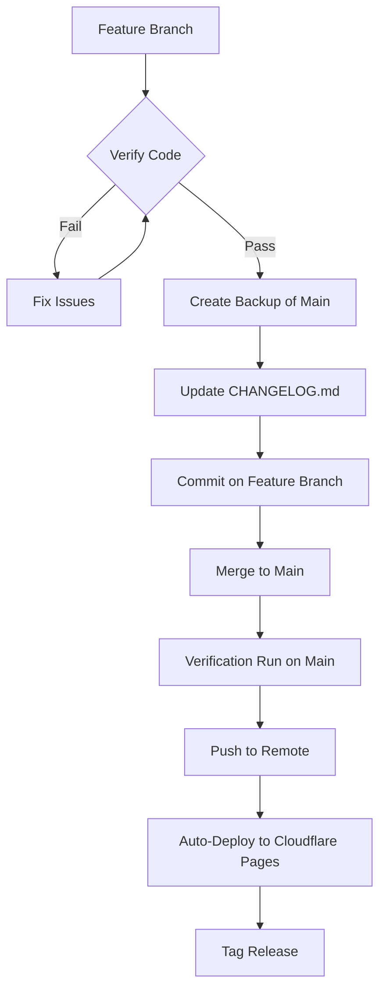

# Workflow: Merge to Main (Safe Release)

## Visual Flow


## Description
Standard protocol for merging feature branches to `main`. Ensures code quality, creates safety backups, and maintains documentation.

---

## 1. Pre-Merge Verification
**Run the full verification workflow first:**
// turbo
```bash
dart run build_runner build --delete-conflicting-outputs
```
// turbo
```bash
flutter analyze
```
// turbo
```bash
flutter test --exclude-tags=golden
```
```bash
flutter test --tags=golden
```

> [!CAUTION]
> **STOP** if any phase fails. Fix issues before proceeding.

---

## 2. Test Integrity Check (Constitutional Requirement)
> **Refer to**: `DEVELOPMENT_CONSTITUTION.md` Section 2.6

**Before creating a backup, verify you haven't violated the Test Integrity Protocol:**

> [!IMPORTANT]
> **Default Assumption**: If a test fails, assume **YOUR CODE IS WRONG**, not the test.
> *   Do not automatically check "is the test wrong?".
> *   True check: **Is the new code good or bad?**
> *   Only modify tests if requirements have fundamentally changed.

1.  **Did you modify existing tests?**
    -   [ ] No: Proceed.
    -   [ ] Yes: **Justify why**. Did requirements change? If not, **revert the test change and fix the code**.
2.  **Did you add `skip` or comment out tests?**
    -   [ ] Yes: **STOP**. This is forbidden. Fix the code or add a formal tracking issue link.
3.  **Did you widen assertions?** (e.g., `expect(200)` -> `expect(isNotNull)`)
    -   [ ] Yes: **STOP**. This is forbidden.

> [!WARNING]
> Merging a "relaxed" test to `main` corrupts the repository's truth.

---

## 2. Create Safety Backup
**Before merging, create a backup branch of main:**

**On Linux/macOS (bash):**
```bash
git checkout main
git branch backup/main-pre-merge-$(date +%Y-%m-%d)
```

**On Windows (PowerShell):**
```powershell
git checkout main
git branch "backup/main-pre-merge-$(Get-Date -Format 'yyyy-MM-dd')"
```

> [!TIP]
> If a backup branch already exists for today, add a suffix like `-v2` or use timestamp: `$(Get-Date -Format 'yyyy-MM-dd-HHmm')`

**Naming Convention**: `backup/main-pre-merge-YYYY-MM-DD`

> [!TIP]
> This allows instant rollback if something goes wrong post-merge.

---

## 3. Atomic Release Update
**Update version and changelog in a single dedicated commit:**

1.  **Bump Version**: Update `version: X.Y.Z` in `pubspec.yaml`.
2.  **Update CHANGELOG.md**: 
    - Move items from `[Unreleased]` to a new version section.
    - Ensure date matches current day.
3.  **Atomic Commit**:
    ```bash
    git add pubspec.yaml CHANGELOG.md
    git commit -m "chore: release vX.Y.Z"
    ```

---

## 4. Final Verification & Commit
**Verify everything one last time before merge:**

```bash
git add -A
git commit -m "<type>: <description>

<optional body with details>

Closes #<issue-number>"
```

> [!NOTE]
> If the release commit was the only change remaining, you can proceed directly to merge.


**Commit Types:**
| Type | When to Use |
|:---|:---|
| `feat` | New feature |
| `fix` | Bug fix |
| `perf` | Performance improvement |
| `refactor` | Code restructuring (no behavior change) |
| `docs` | Documentation only |
| `test` | Adding/fixing tests |
| `chore` | Maintenance (deps, config) |

> [!NOTE]
> **New subdirectories with `node_modules`**: If your feature adds a Node.js project (e.g., Cloudflare Worker), ensure a `.gitignore` file excludes `node_modules/` and `package-lock.json`.

---

## 5. Merge to Main
```bash
git checkout main
git merge <feature-branch> --no-edit
```

> [!NOTE]
> Use `--no-edit` for fast-forward merges. For complex merges, write a descriptive merge commit.

---

## 6. Push and Tag (Optional)
**Push to remote:**
```bash
git push origin main
```

> [!NOTE]
> Pushing to `main` triggers automatic deployment to **Cloudflare Pages** via GitHub Actions.

**Create version tag (for releases):**
```bash
git tag -a v0.X.Y -m "Release v0.X.Y: <summary>"
git push origin v0.X.Y
```

---

## 7. Cleanup (Optional)
**Delete merged feature branch:**
```bash
git branch -d <feature-branch>
git push origin --delete <feature-branch>
```

**Keep backup branches for 7 days**, then clean up:
```bash
git branch -D backup/main-pre-merge-<old-date>
```

---

## Quick Reference

### Minimum Safe Merge (PowerShell)
```powershell
# 1. Verify
flutter analyze; flutter test

# 2. Commit
git add -A; git commit -m "feat: description"

# 3. Backup + Merge
git checkout main
git branch "backup/main-pre-merge-$(Get-Date -Format 'yyyy-MM-dd')"
git merge <feature-branch> --no-edit

# 4. Push
git push origin main
```

### Minimum Safe Merge (bash)
```bash
# 1. Verify
flutter analyze && flutter test

# 2. Commit
git add -A && git commit -m "feat: description"

# 3. Backup + Merge
git checkout main
git branch backup/main-pre-merge-$(date +%Y-%m-%d)
git merge <feature-branch> --no-edit

# 4. Push
git push origin main
```

### Rollback if Needed
```bash
git checkout main
git reset --hard backup/main-pre-merge-YYYY-MM-DD
git push origin main --force
```

> [!WARNING]
> Force push to main should be rare. Only use for critical rollbacks.
